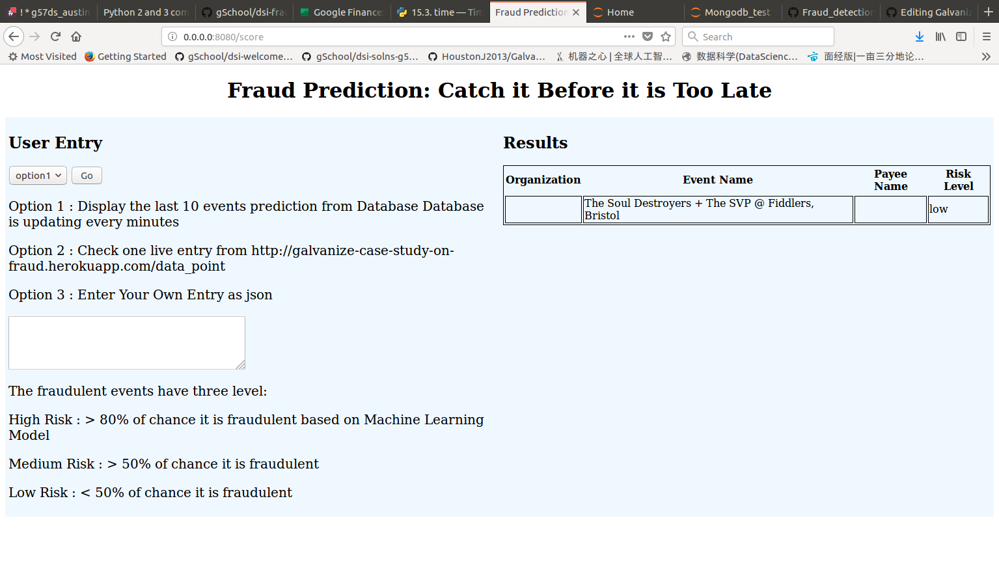

This folder contains the web application of the fraud prediciton model. We read data points lively from http://galvanize-case-study-on-fraud.herokuapp.com/data_point, which generate purchase record for prediction. 

The system requirement:
+ Python 2.7
+ Pymongo 3.4.0
+ flask 0.12.2
+ cPickle 1.71
+ urllib2 2.7


The record is read and made fraud prediciton based on a Random Forest Model we trained on preprietary data sets from Galvanize. User has three options to make prediction: 
+ option 1. Look at the fraudulent events prediction in the database. 
+ option 2. Read one entry from Galvanize website and make prediction
+ option 3. User upload an entry from web app and make prediction

 


To run the app code. 
```
python app.py 
```


